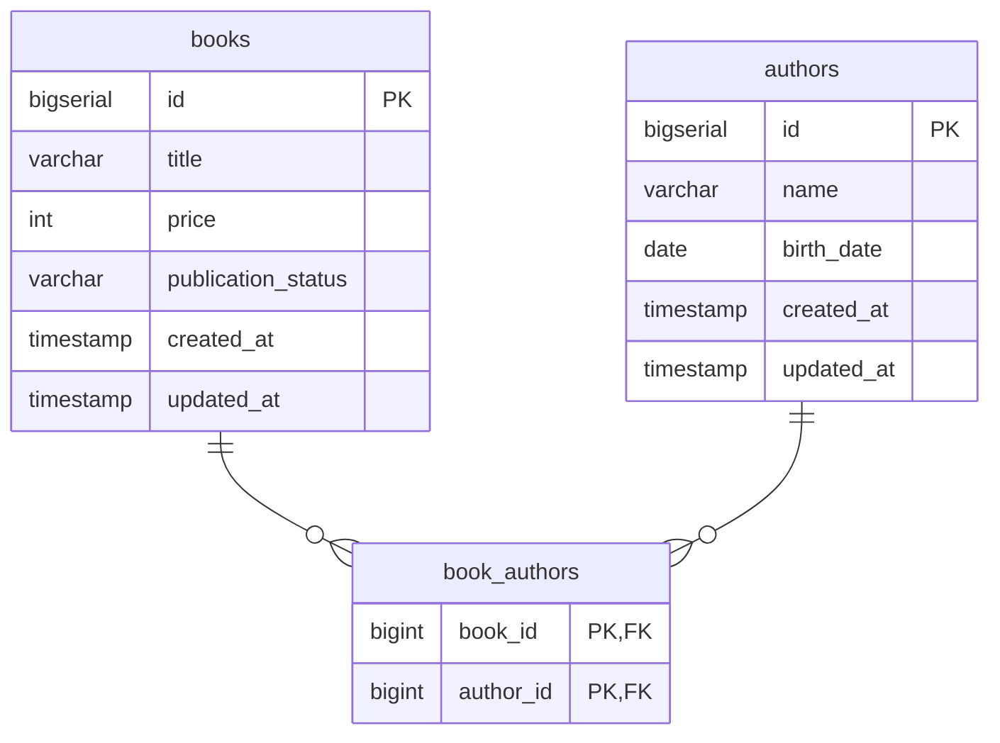

# Book Management API

## 概要
書籍と著者を管理するバックエンドAPIです。
著者と書籍は多対多の関係を持ちます。

## 技術スタック
- Kotlin
- Spring Boot
- jOOQ
- PostgreSQL
- Flyway

## 構成
- Controller: リクエスト受付・バリデーション・レスポンス変換
- Service: 業務ロジック
- Repository: DB操作

## 実装方針
- 業務ルール（価格制約、出版ステータス制約）をService層で管理
- 著者と書籍の多対多関係を中間テーブルで実装
- Controller / Service / Repository の責務分離
- テストで正常系・異常系をカバー

## 起動方法
```bash
docker-compose up -d
./gradlew bootRun
```

## テスト実行
```bash
./gradlew test
```

## API エンドポイント

### 著者

| メソッド | パス | 説明 |
|--------|------|------|
| POST | `/authors` | 著者を登録する |
| PUT | `/authors/{authorId}` | 著者を更新する |
| GET | `/authors/{authorId}/books` | 著者に紐づく書籍一覧を取得する |

#### POST /authors リクエスト例
```json
{
  "name": "夏目漱石",
  "birthDate": "1867-02-09"
}
```

#### PUT /authors/{authorId} リクエスト例
```json
{
  "name": "夏目漱石",
  "birthDate": "1867-02-09"
}
```

### 書籍

| メソッド | パス | 説明 |
|--------|------|------|
| POST | `/books` | 書籍を登録する |
| PUT | `/books/{bookId}` | 書籍を更新する |

#### POST /books リクエスト例
```json
{
  "title": "吾輩は猫である",
  "price": 1000,
  "publicationStatus": "UNPUBLISHED",
  "authorIds": [1]
}
```

#### PUT /books/{bookId} リクエスト例
```json
{
  "title": "吾輩は猫である",
  "price": 1000,
  "publicationStatus": "PUBLISHED",
  "authorIds": [1]
}
```

## バリデーションルール

### 著者
- `name`: 必須
- `birthDate`: 現在日以前であること

### 書籍
- `title`: 必須
- `price`: 0以上であること
- `authorIds`: 1人以上指定すること
- `publicationStatus`: `PUBLISHED` → `UNPUBLISHED` への変更不可

## 出版ステータス
| 値 | 説明 |
|----|------|
| `UNPUBLISHED` | 未出版 |
| `PUBLISHED` | 出版済み |

## ER図


